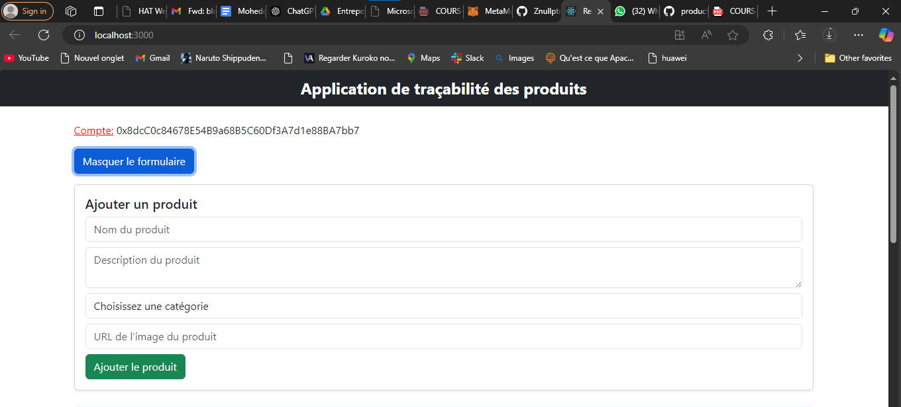
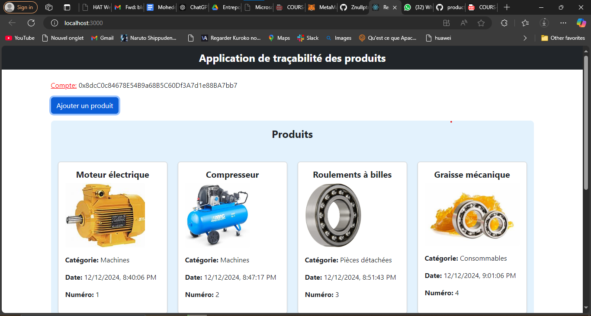
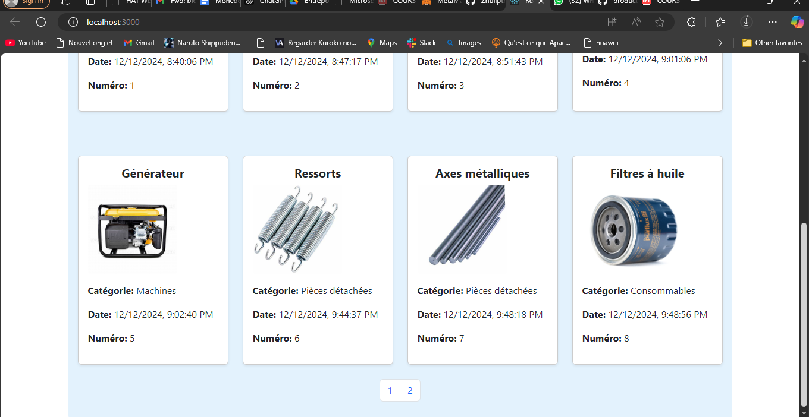
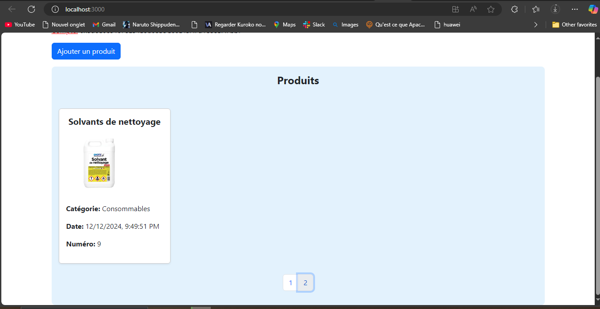

# Application de Traçabilité des Produits

Cette application permet de certifier la date d'arrivée des produits au sein d'une usine, en utilisant la technologie de la blockchain pour enregistrer les produits. Chaque produit est associé à un numéro unique qui s'incrémente à chaque ajout, et contient des informations supplémentaires telles que son nom, sa catégorie et une description. Le tout est enregistré dans la blockchain via **Ganache**, avec une interface utilisateur construite en **React**.

## Technologies Utilisées

- **Ganache** : Un simulateur de blockchain pour développer des applications Ethereum.
- **React** : Une bibliothèque JavaScript pour construire l'interface utilisateur.
- **Truffle** : Un framework pour le développement de contrats intelligents.
- **MetaMask** : Une extension de navigateur qui sert de porte-monnaie pour interagir avec la blockchain Ethereum.

## Fonctionnalités

- Enregistrement des produits dans la blockchain.
- Chaque produit a un numéro unique qui s'incrémente automatiquement lors de l'ajout d'un nouveau produit.
- Enregistrement des informations suivantes pour chaque produit :
  - Nom
  - Catégorie
  - Description
  - Date d'enregistrement (automatiquement certifiée dans la blockchain)
- Interface simple en React pour interagir avec les utilisateurs.

## Prérequis

Avant de pouvoir utiliser l'application, vous devez avoir les éléments suivants installés sur votre machine :

1. **Node.js** : [Télécharger et installer Node.js](https://nodejs.org/)
1. **Truffles** :
     ```bash 
        npm install -g truffle
2. **Ganache** : [Télécharger et installer Ganache](https://www.trufflesuite.com/ganache)
3. **MetaMask** : [Installer l'extension MetaMask pour votre navigateur](https://metamask.io/)

## Installation et Configuration

1. **Cloner le projet**

   Clonez ce dépôt sur votre machine locale :

   ```bash
   git clone  https://github.com/GNUITOdebora/product-traceability.git
   cd product-traceability

2. **Installer les dépendances** 
    ```bash
    npm install
3. **Déployer les contrats intelligents avec Truffle**
   ```bash
      truffle compile
      truffle migrate 
4. **Lancer l'application React**
    ```bash
       npm start
## Utilisation

Pour utiliser l'application, suivez ces étapes :

* Ouvrez votre navigateur et accédez à http://localhost:3000.
* Ouvrez MetaMask et connectez-vous avec un compte Ethereum.
* Sélectionnez l'un des comptes générés par Ganache pour interagir avec l'application.
* Une fois l'application ouverte, vous pourrez voir une liste de produits enregistrés dans la blockchain.
* Vous pouvez ajouter de nouveaux produits via le formulaire en remplissant les informations requises (nom, catégorie, description).

## Présentation du Projet

1. **Ajouter un produit**
Ajouter un produit Il suiffit de remplir le champs indiqués




2. **Liste des produits avec leurs attributs**








    

